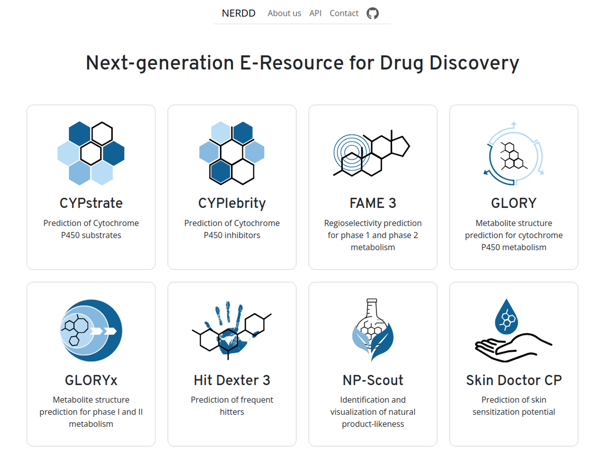
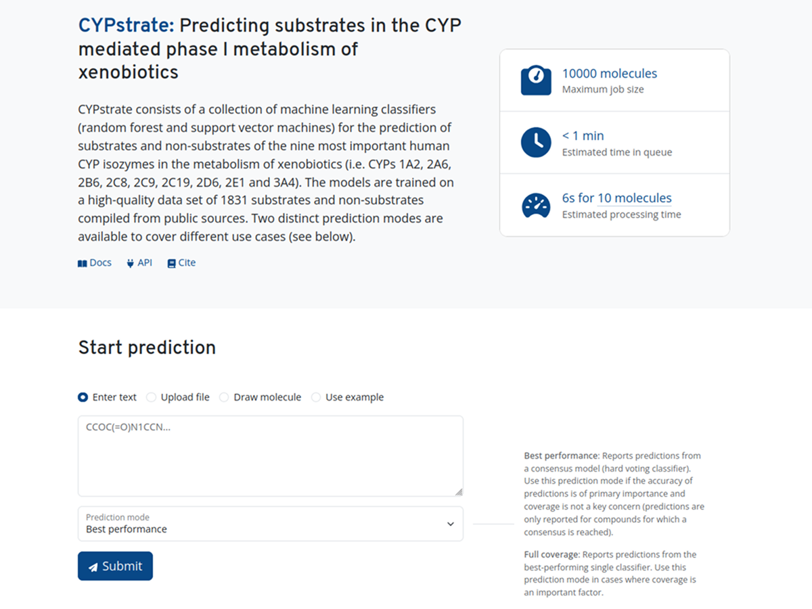
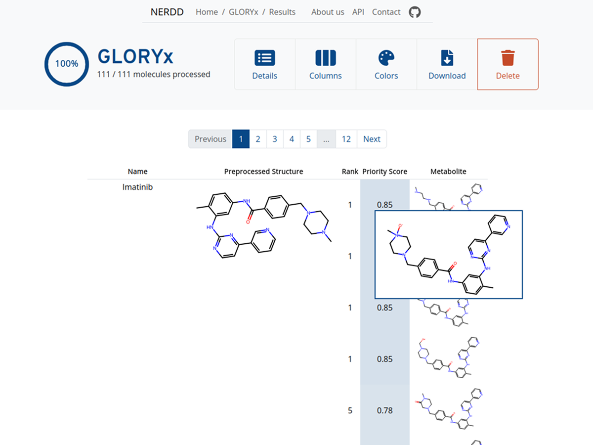
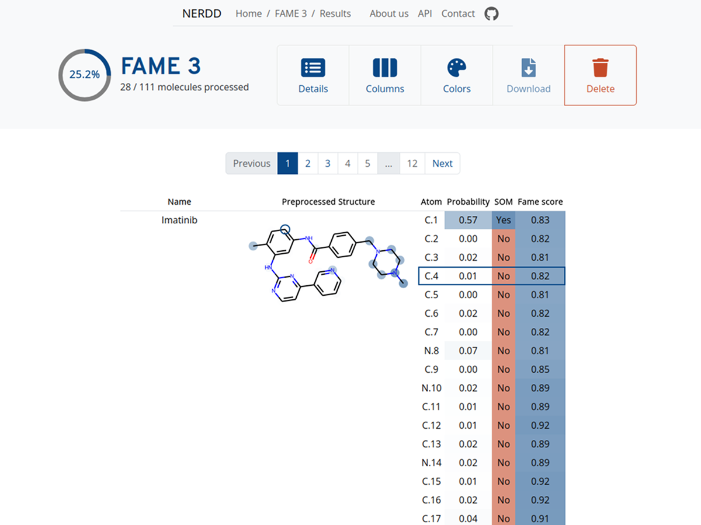

<h1 align="center">
    nerdd-frontend
</h1>

<a href="https://github.com/molinfo-vienna/nerdd-module">📦 nerdd-module</a>
•
<a href="https://github.com/molinfo-vienna/nerdd-link">🔗 nerdd-link</a>
•
<a href="https://github.com/molinfo-vienna/nerdd">⚙️ Infrastructure</a>
•
<a href="https://nerdd.univie.ac.at">🌐 NERDD website</a>

 

## Introduction

**nerdd-frontend** is a web interface for prediction models in cheminformatics. nerdd-frontend is
part of the NERDD platform, which provides access to a collection of prediction models. Based on
that, nerdd-frontend gives each model

* an entry on the landing page,
* a prediction form based on the model's input specification,
* a results page showing prediction results in a structured data table, and
* additional pages for model documentation and API usage.

The application was built with React and offers:

* a single-page application architecture,
* user-friendly prediction forms with tooltips on all form fields,
* real-time result streaming via WebSockets,
* a mobile-friendly experience that works on phones and tablets,
* auto-generated REST API documentation, and
* flexible output visualization adapting to the model's configuration.

## Contribute

* Fork and clone the code
* `npm install`
* `npm start`
* open a browser on localhost:3000
* Note: the frontend is able to generate mock data and can be tested without a backend system

